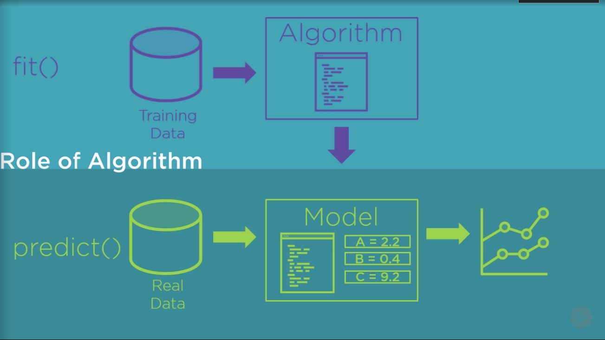
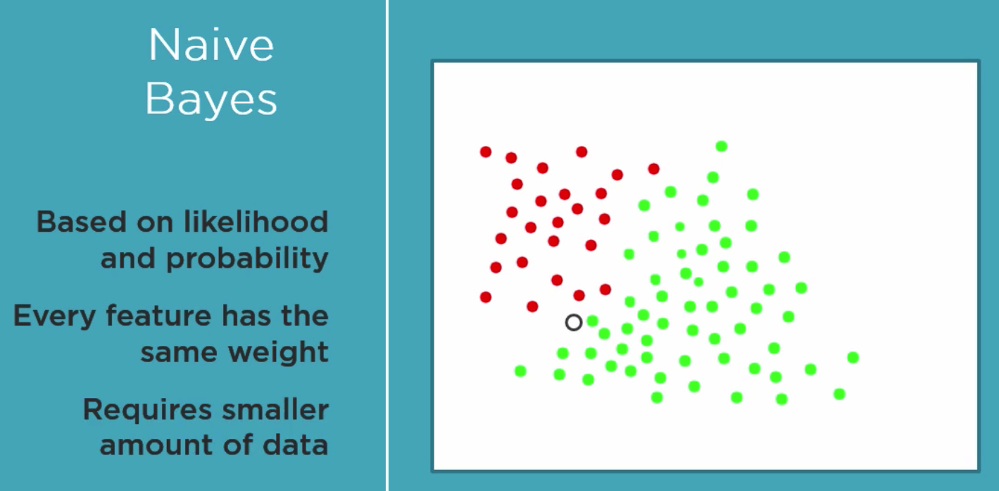
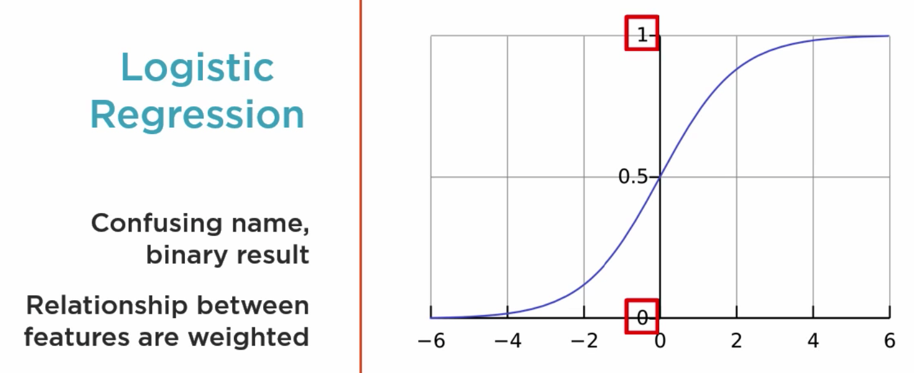
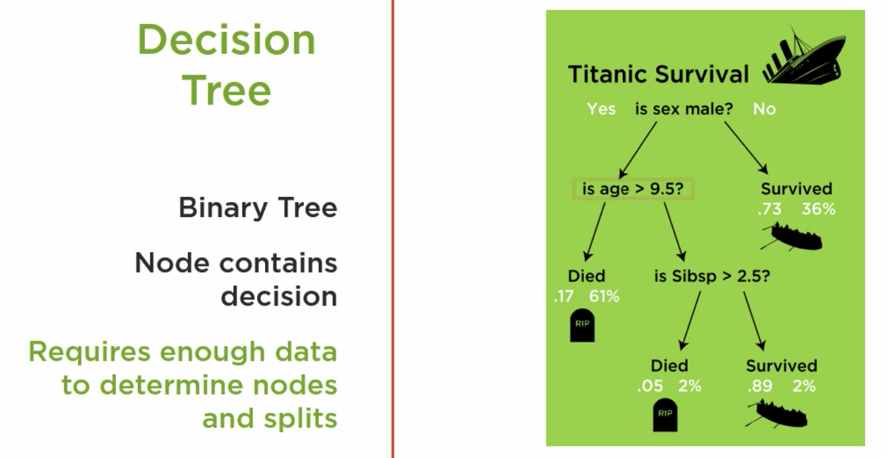

# Machine Learning with Python

**Problem Statement:** Use Machine Learning to process and transform Pima Indian data to create a prediction model. This model must predict with people are likely to develop diabetes with 70% or greater accuracy.

#### *ML Algorithm for predicting patients Diabetes* using Supervised Learning

Candidate Algorithms
1. Naiave Bayes
2. Logic Regression
3. Decision Tree

**Naive Bayes** - Bases on likelihood and probability on previous data, combined with the probability with nearby feature values. *Ex. How often the person having high blood pressure correlate with having diabetes.*  It makes the navie assumption that all fo the features we pass in are independent of each other and equally impact the result. This algorithm requires a small amount of data to train.  

**Logistic Regression** - Returns a Binary result. The algorithm measures values of each feature and weights them based on their impact on the result. The result and values are mapped against a curve between 1 and 0, which is equivalent to diabetes or no diabetes in our case.

**Decision Tree** - Uses a binary tree structure, which each node making a decision based upon values of the feature. At each node, the feature value causes us to go down one path or another. May require alot of data to determent the outcome. 

### Training
Split data between training and test

**scikit-lean** will be used for training functions